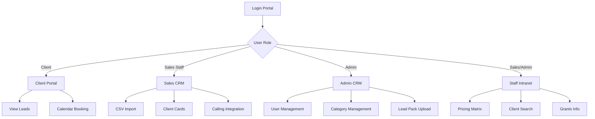

## 1. Product Overview
A comprehensive lead generation platform that connects businesses with qualified leads through categorized lead management, client portals, and staff CRM systems. The platform enables efficient lead distribution, client self-service, and internal sales team management.

The platform serves lead generation companies to streamline lead sales, client management, and internal operations while providing clients with transparent access to their purchased leads and booking capabilities.

## 2. Core Features

### 2.1 User Roles
| Role | Registration Method | Core Permissions |
|------|---------------------|------------------|
| Client | Admin invitation/creation | View purchased leads, book appointments, access client portal |
| Sales Staff | Admin creation | Access sales CRM, process leads, make calls, view pricing |
| Admin | Super admin creation | Full system access, manage users, upload leads, configure categories |
| Super Admin | System initialization | Complete platform control, assign admin roles |

### 2.2 Feature Module
Our lead generation platform consists of the following main pages:
1. **Login Portal**: Team login access, role-based redirect system
2. **Client Portal**: Lead viewing, calendar booking, purchased leads management
3. **Sales CRM**: Lead processing, client cards, CSV import, calling integration
4. **Admin CRM**: User management, lead upload, category configuration, system settings
5. **Staff Intranet**: Pricing matrix, grants information, client search, internal resources

### 2.3 Page Details
| Page Name | Module Name | Feature description |
|-----------|-------------|---------------------|
| Login Portal | Team Login | Access sales CRM, admin CRM, or intranet based on user role |
| Client Portal | Lead Dashboard | Display purchased leads with filtering by category and date |
| Client Portal | Calendar Modal | View and manage booked appointments for leads |
| Sales CRM | Lead Import | Upload CSV files, duplicate checking, automatic lead addition |
| Sales CRM | Client Cards | Display complete client information from CSV data, clickable phone numbers |
| Sales CRM | Calling Integration | SIP phone integration for one-click dialing |
| Admin CRM | Category Management | Create/delete main categories (Solar, Solar Cleaning, Roofing, Asbestos) and subcategories |
| Admin CRM | User Management | Create/modify user accounts, assign roles and permissions |
| Admin CRM | Lead Pack Management | Configure and manage lead packages for clients |
| Staff Intranet | Pricing Matrix | Display pricing information and structures |
| Staff Intranet | Client Search | Search and view client information |
| Staff Intranet | Grants Section | Display available grants and funding information |

## 3. Core Process
**Client Flow**: Access client portal → View purchased leads → Filter by category → Book appointments via calendar modal → Track lead status

**Sales Staff Flow**: Login via team portal → Access sales CRM → Import CSV leads → Process duplicate-free leads → Use client cards with calling integration → Update lead status

**Admin Flow**: Login with admin credentials → Access admin CRM → Manage user accounts → Configure categories and subcategories → Upload lead packs → Monitor system activity

**Super Admin Flow**: Initialize system → Create admin accounts → Configure platform settings → Assign admin roles

## 4. User Interface Design

### 4.1 Design Style
- **Primary Colors**: Professional blue (#2563eb) for headers and CTAs, white background
- **Secondary Colors**: Gray (#6b7280) for text, green (#10b981) for success states
- **Button Style**: Rounded corners (8px radius), clear hover states, consistent sizing
- **Font**: Inter font family, 16px base size, clear hierarchy with H1-H6
- **Layout**: Card-based design with proper spacing, top navigation for main sections
- **Icons**: Feather icons for consistency, intuitive symbols for actions

### 4.2 Page Design Overview
| Page Name | Module Name | UI Elements |
|-----------|-------------|-------------|
| Login Portal | Team Login | Centered card layout, role selection buttons, clean background |
| Client Portal | Lead Dashboard | Filter sidebar, lead cards with category tags, pagination |
| Client Portal | Calendar Modal | Full-screen overlay, monthly view, booking slots |
| Sales CRM | Client Cards | Expandable cards, phone number links, action buttons |
| Sales CRM | CSV Import | Drag-and-drop zone, progress indicator, duplicate report |
| Admin CRM | Category Management | Tree view for categories, add/edit/delete buttons |
| Staff Intranet | Pricing Matrix | Table layout with sortable columns, search functionality |

### 4.3 Responsiveness
Desktop-first design approach with mobile adaptation. Primary use case is desktop for CRM functionality, but responsive design ensures access on tablets and mobile devices for client portal viewing.

### 4.4 3D Scene Guidance
Not applicable - this is a business application focused on data management and CRM functionality.