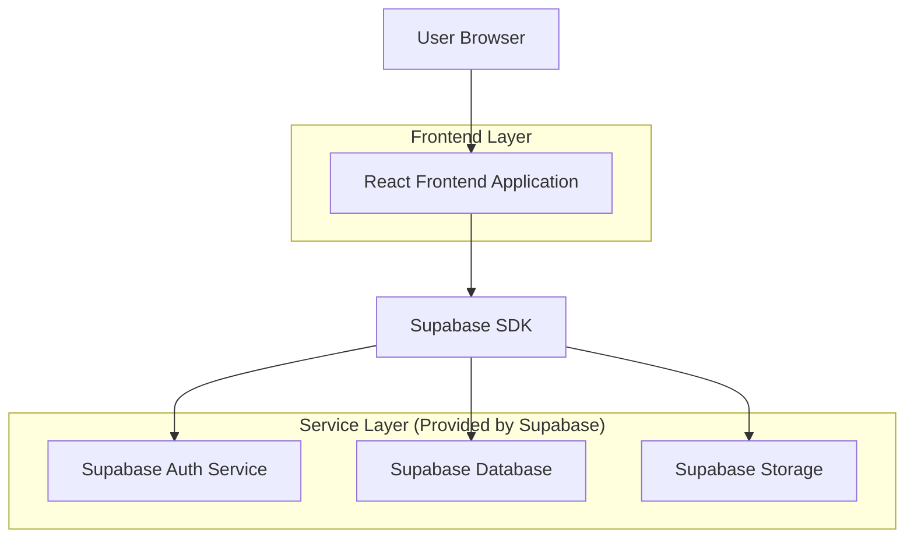
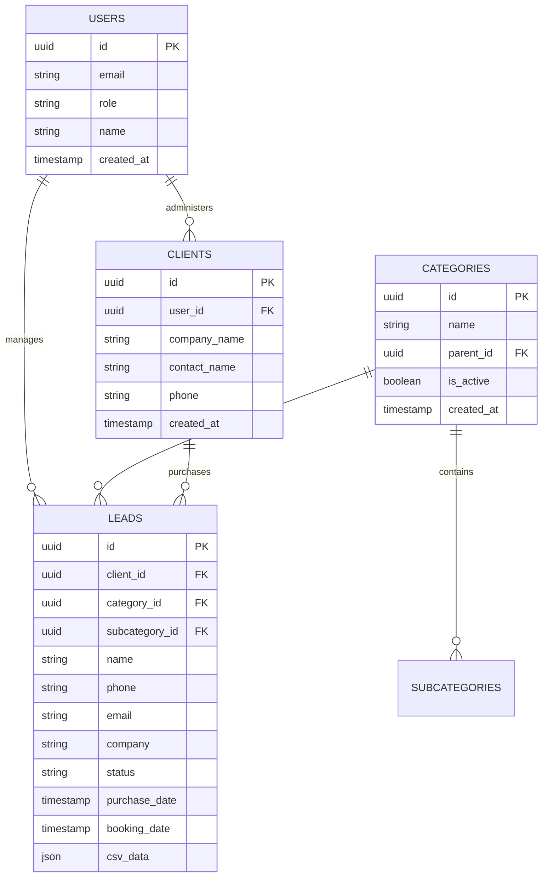

## 1. Architecture design



## 2. Technology Description
- Frontend: React@18 + tailwindcss@3 + vite
- Initialization Tool: vite-init
- Backend: Supabase (PostgreSQL, Auth, Storage)
- Key Dependencies: @supabase/supabase-js, react-router-dom, react-hook-form, lucide-react

## 3. Route definitions
| Route | Purpose |
|-------|---------|
| / | Login portal with team access |
| /client-portal | Client dashboard for viewing purchased leads |
| /sales-crm | Sales staff CRM for lead processing |
| /admin-crm | Admin panel for system management |
| /intranet | Staff intranet with pricing and resources |
| /login | Authentication page |

## 4. API definitions

### 4.1 Authentication APIs
```
POST /auth/v1/token
```

Request:
| Param Name | Param Type | isRequired | Description |
|------------|------------|------------|-------------|
| email | string | true | User email address |
| password | string | true | User password |

Response: Supabase session object with access token and user data

### 4.2 Lead Management APIs
```
GET /rest/v1/leads
POST /rest/v1/leads
PUT /rest/v1/leads
DELETE /rest/v1/leads
```

Lead Object:
```json
{
  "id": "uuid",
  "client_id": "uuid",
  "category_id": "uuid",
  "subcategory_id": "uuid",
  "name": "string",
  "phone": "string",
  "email": "string",
  "company": "string",
  "status": "string",
  "purchase_date": "timestamp",
  "booking_date": "timestamp"
}
```

### 4.3 Category Management APIs
```
GET /rest/v1/categories
POST /rest/v1/categories
DELETE /rest/v1/categories
```

Category Object:
```json
{
  "id": "uuid",
  "name": "string",
  "parent_id": "uuid",
  "is_active": "boolean"
}
```

## 5. Server architecture diagram
Not applicable - Using Supabase BaaS architecture with client-side SDK integration.

## 6. Data model

### 6.1 Data model definition


### 6.2 Data Definition Language

Users Table (users)
```sql
-- create table
CREATE TABLE users (
    id UUID PRIMARY KEY DEFAULT gen_random_uuid(),
    email VARCHAR(255) UNIQUE NOT NULL,
    role VARCHAR(50) NOT NULL CHECK (role IN ('client', 'sales', 'admin', 'super_admin')),
    name VARCHAR(100) NOT NULL,
    created_at TIMESTAMP WITH TIME ZONE DEFAULT NOW()
);

-- grant permissions
GRANT SELECT ON users TO anon;
GRANT ALL PRIVILEGES ON users TO authenticated;
```

Categories Table (categories)
```sql
-- create table
CREATE TABLE categories (
    id UUID PRIMARY KEY DEFAULT gen_random_uuid(),
    name VARCHAR(100) NOT NULL,
    parent_id UUID REFERENCES categories(id),
    is_active BOOLEAN DEFAULT true,
    created_at TIMESTAMP WITH TIME ZONE DEFAULT NOW()
);

-- grant permissions
GRANT SELECT ON categories TO anon;
GRANT ALL PRIVILEGES ON categories TO authenticated;
```

Leads Table (leads)
```sql
-- create table
CREATE TABLE leads (
    id UUID PRIMARY KEY DEFAULT gen_random_uuid(),
    client_id UUID REFERENCES clients(id),
    category_id UUID REFERENCES categories(id),
    subcategory_id UUID REFERENCES categories(id),
    name VARCHAR(100) NOT NULL,
    phone VARCHAR(20) NOT NULL,
    email VARCHAR(255),
    company VARCHAR(200),
    status VARCHAR(50) DEFAULT 'new',
    purchase_date TIMESTAMP WITH TIME ZONE,
    booking_date TIMESTAMP WITH TIME ZONE,
    csv_data JSONB,
    created_at TIMESTAMP WITH TIME ZONE DEFAULT NOW()
);

-- create indexes
CREATE INDEX idx_leads_client_id ON leads(client_id);
CREATE INDEX idx_leads_category_id ON leads(category_id);
CREATE INDEX idx_leads_status ON leads(status);
CREATE INDEX idx_leads_purchase_date ON leads(purchase_date DESC);

-- grant permissions
GRANT SELECT ON leads TO anon;
GRANT ALL PRIVILEGES ON leads TO authenticated;
```

Clients Table (clients)
```sql
-- create table
CREATE TABLE clients (
    id UUID PRIMARY KEY DEFAULT gen_random_uuid(),
    user_id UUID REFERENCES users(id),
    company_name VARCHAR(200) NOT NULL,
    contact_name VARCHAR(100) NOT NULL,
    phone VARCHAR(20) NOT NULL,
    created_at TIMESTAMP WITH TIME ZONE DEFAULT NOW()
);

-- grant permissions
GRANT SELECT ON clients TO anon;
GRANT ALL PRIVILEGES ON clients TO authenticated;
```

Row Level Security (RLS) Policies
```sql
-- Enable RLS on all tables
ALTER TABLE users ENABLE ROW LEVEL SECURITY;
ALTER TABLE clients ENABLE ROW LEVEL SECURITY;
ALTER TABLE categories ENABLE ROW LEVEL SECURITY;
ALTER TABLE leads ENABLE ROW LEVEL SECURITY;

-- Users can only see their own data
CREATE POLICY users_read_policy ON users FOR SELECT USING (auth.uid() = id);

-- Clients can only see their own leads
CREATE POLICY leads_client_policy ON leads FOR SELECT USING (
    auth.uid() IN (SELECT user_id FROM clients WHERE id = leads.client_id)
);

-- Sales staff can see all leads
CREATE POLICY leads_sales_policy ON leads FOR SELECT USING (
    EXISTS (SELECT 1 FROM users WHERE id = auth.uid() AND role = 'sales')
);

-- Admins can manage everything
CREATE POLICY admin_policy ON leads FOR ALL USING (
    EXISTS (SELECT 1 FROM users WHERE id = auth.uid() AND role IN ('admin', 'super_admin'))
);
```