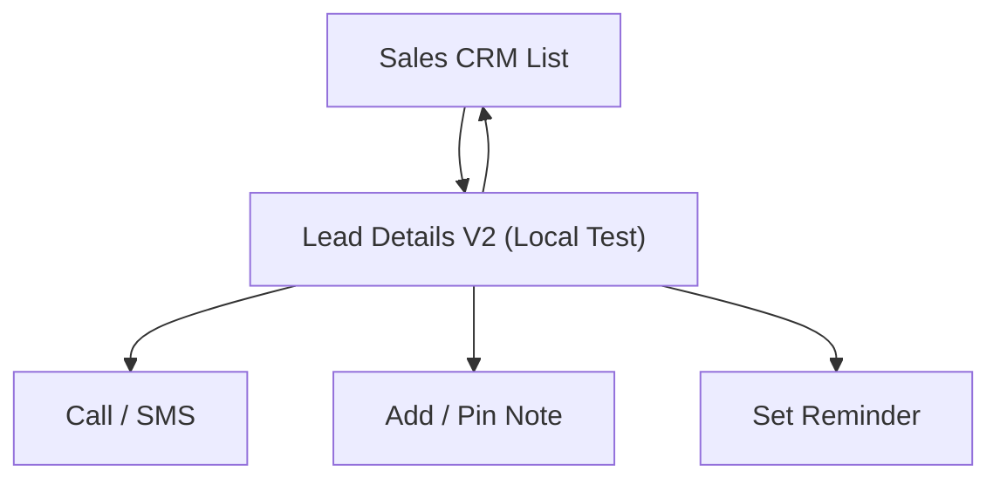

## 1. Product Overview
Sales CRM Lead Details V2 is a redesigned lead detail view for internal sales use.
It is accessible only via a separate “local testing” route and mirrors the provided UI.

## 2. Core Features

### 2.1 User Roles
| Role | Registration Method | Core Permissions |
|------|---------------------|------------------|
| Sales/Rep (authenticated) | Existing Supabase auth | View lead details, add notes, update assignment/status, initiate call/SMS, set reminders |
| Admin/Super Admin (authenticated) | Existing Supabase auth | All Sales permissions + market/edit marketed lead (if enabled) |

### 2.2 Feature Module
Our requirements consist of the following main pages:
1. **Lead Details V2 (Local Test)**: header (back + lead title), status/assignment controls, contact actions (call/SMS), lead attributes panels, notes + pinned notes, reminders, activity widgets.

### 2.3 Page Details
| Page Name | Module Name | Feature description |
|---|---|---|
| Lead Details V2 (Local Test) | Local-only access gate | Restrict access to authenticated users and to local/dev environments only; hide from primary navigation. |
| Lead Details V2 (Local Test) | Header + controls | Show lead title (company or name); provide back to list; allow update status; allow re-assign to staff user; show “Next Lead” (optional if next id provided). |
| Lead Details V2 (Local Test) | Contact actions | Start call to primary/secondary phone; open SMS composer; log outcomes as notes/messages. |
| Lead Details V2 (Local Test) | Lead info panels | Display contact + company + location and key qualification attributes consistent with the provided UI (read-only unless “Edit” is used). |
| Lead Details V2 (Local Test) | Notes & pinning | List notes newest-last; allow add note; allow pin/unpin; show pinned notes at top. |
| Lead Details V2 (Local Test) | Reminders | Create follow-up reminder (date/time + content); show completion state if present. |
| Lead Details V2 (Local Test) | Data loading & errors | Fetch lead + notes + reminders; show loading state; show “not found” and permission errors. |
| Lead Details V2 (Local Test) | Data requirements (DB fields / CSV columns) | Require the following fields to render the V2 UI; any extra CSV columns not mapped must be preserved in `csv_data`.

**Required database fields / CSV columns (minimum set)**
| Field (UI) | DB column | CSV column(s) |
|---|---|---|
| Lead identifier | leads.id | (system-generated) |
| Contact name | leads.name | name, full name, first+last |
| Primary phone | leads.phone | phone, mobile, telephone |
| Email | leads.email | email |
| Company | leads.company | company, business name |
| Location | leads.location | location, address/city/state/zip |
| Status | leads.status | status (or derive: fresh/qualified/etc.) |
| Assigned owner | leads.assigned_to | (optional) |
| Secondary numbers | leads.other_contact_numbers | phone2/alt phone (optional) |
| Secondary contact | leads.other_contacts | other contact (optional) |
| Raw source row | leads.csv_data | all columns (full row JSON) |
| Upload batch label | leads.upload_name | upload_name (optional) |
| Call recency | leads.last_dialed_at | (system-generated) |
| Notes | lead_notes.content | (n/a) |
| Reminders | lead_reminders.reminder_at/content | (n/a) |

## 3. Core Process
**Sales/Rep Flow**
1) Navigate to the local-test route with a lead id.
2) Review lead summary and qualification panels.
3) Call or SMS the lead; add a note and optionally pin it.
4) Update status and/or assigned owner.
5) Set a follow-up reminder.

