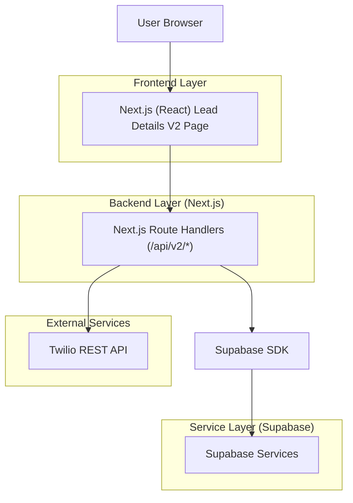
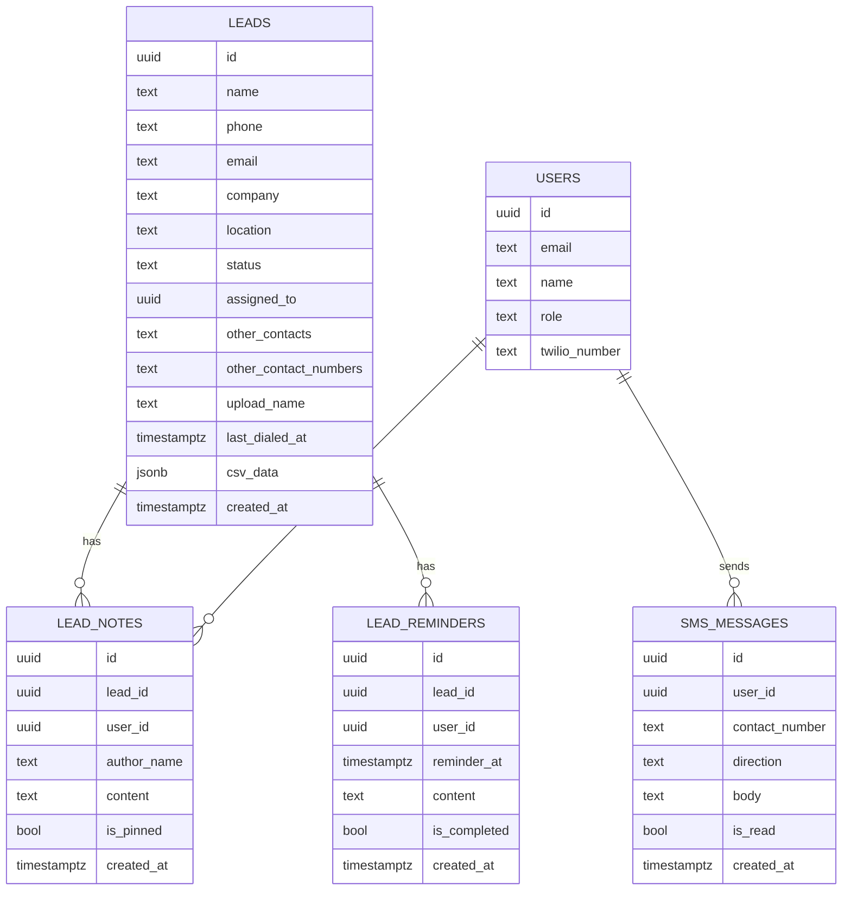

## 1.Architecture design


## 2.Technology Description
- Frontend: Next.js@16 + React@18 + tailwindcss@3 + TypeScript
- Backend: Next.js Route Handlers (server-side)
- Database/Auth: Supabase (PostgreSQL + Auth)
- Optional messaging/calling (mirrors UI actions): Twilio (SMS/Voice)

## 3.Route definitions
| Route | Purpose |
|---|---|
| /sales-crm/lead-v2?id=LEAD_ID | Local-testing entry point for Lead Details V2 (not linked in nav) |

## 4.API definitions (If it includes backend services)
### 4.1 Core API
Fetch lead details (lead + related notes/reminders)
```
GET /api/v2/leads/{id}
```

Create a lead note
```
POST /api/v2/leads/{id}/notes
```
Request:
| Param Name| Param Type | isRequired | Description |
|---|---|---|---|
| content | string | true | Note text |
| is_pinned | boolean | false | Pin at top |

Set reminder
```
POST /api/v2/leads/{id}/reminders
```

Send SMS (uses server-side Twilio credentials)
```
POST /api/twilio/send-sms
```

Shared types (TypeScript)
```ts
type LeadStatus = 'fresh' | 'no pitch' | 'call back' | 'dnc' | 'qualified';

type LeadV2 = {
  id: string;
  name: string;
  phone: string;
  email: string | null;
  company: string | null;
  location: string | null;
  status: LeadStatus;
  assigned_to: string | null;
  other_contacts: string | null;
  other_contact_numbers: string | null;
  upload_name: string | null;
  last_dialed_at: string | null;
  csv_data: unknown | null;
  created_at: string;
};

type LeadNoteV2 = {
  id: string;
  lead_id: string;
  user_id: string;
  author_name: string;
  content: string;
  is_pinned: boolean;
  created_at: string;
};
```

## 6.Data model(if applicable)
### 6.1 Data model definition


### 6.2 Data Definition Language
Leads (minimum columns required by Lead Details V2)
```
CREATE TABLE leads (
  id UUID PRIMARY KEY DEFAULT gen_random_uuid(),
  name TEXT NOT NULL,
  phone TEXT NOT NULL,
  email TEXT NULL,
  company TEXT NULL,
  location TEXT NULL,
  status TEXT NOT NULL,
  assigned_to UUID NULL,
  other_contacts TEXT NULL,
  other_contact_numbers TEXT NULL,
  upload_name TEXT NULL,
  last_dialed_at TIMESTAMPTZ NULL,
  csv_data JSONB NULL,
  created_at TIMESTAMPTZ DEFAULT NOW()
);

GRANT SELECT ON leads TO anon;
GRANT ALL PRIVILEGES ON leads TO authenticated;
```